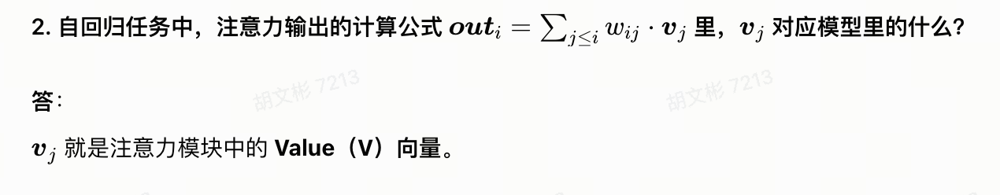

# Transformer 字符级 LLM 核心问答总结
结合本次交流，整理成**一问一答**形式，聚焦训练逻辑、样本、注意力、QKV 等核心问题，方便复盘记忆。

---
## 一、样本与输入序列相关
### 1. 训练时 `x` 和 `y` 分别代表什么？
**答**：
- `x`：模型输入的字符 ID 序列（上下文）；
- `y`：预测目标序列，是 `x` 整体**向右错位一位**的字符 ID；
任务本质：用前文预测下一个字符，是自回归语言模型标准设定。

### 2. 为什么要对序列**每个位置都计算损失**，而不只算最后一位？
**答**：
1. 最大化利用数据：一条固定长度序列可生成多组“上文→下一字”监督信号，提升训练效率；
2. 学习多长度上下文：序列不同位置对应**长短不同的前缀**，全位置损失能让模型学会短、中、长各类上下文依赖；
3. 数学等价于最大化整条文本的联合概率，是 GPT/LLaMA 等主流 LLM 通用训练方式。
> 推理阶段仅取最后一位做续写，和训练逻辑不冲突。

### 3. 训练的输入序列长度是固定的吗？
**答**：
训练时由 `seq_len` 指定，**所有样本长度严格固定**。Transformer 依赖固定维度做批量运算、因果注意力计算，动态长度会大幅降效。

### 4. 什么是「窗口向后移动一位」？
**答**：
采用**滑动窗口采样**：在超长原始文本上，固定长度的样本框每次整体右移 1 位截取新样本。
例：`seq_len=64`，`idx=0` 取 `[0:64]`，`idx=1` 取 `[1:65]`，充分利用整段语料。

### 5. `y` 最后一位下标超出当前 `x` 的范围，为什么不会出错？
**答**：
`x` 和 `y` 都是从**同一份完整原始长文本**上分别切片：
- `x = data[idx:idx+64]`
- `y = data[idx+1:idx+65]`
`y` 的最后一位取自当前窗口之外的下一个字符，正好对应“预测下一字”的目标；同时代码通过 `__len__` 做边界保护，不会下标越界。

### 6. 如果原始文本总长度小于设定的 `seq_len`，会发生什么？怎么解决？
**答**：
1. 现象：`len(data) - seq_len ≤ 0`，数据集样本数为 0，无法训练；
2. 解决方案：
   - 测试场景：**调小 `seq_len`**，保证文本长度大于序列长度；
   - 临时测试：循环拼接短文本，凑够长度；
   - 正式工程：新增 Padding 占位符 + 掩码，兼容长短不一的序列。

---
## 二、模型上下文感知与注意力机制
### 1. 输入是一整条固定长度序列，模型如何感知「前缀上下文长度在变化」？
**答**：
依靠三大机制协同：
1. **因果掩码**：生成下三角矩阵，强制每个位置**只能看到左侧前缀、看不到未来字符**，划定合法上下文范围；
2. **多头自注意力**：每个位置对左侧所有合法前缀做加权求和，前缀越长，融合的信息越多；
3. **位置编码**：给每个绝对位置添加独有特征，让模型识别字符先后顺序。

### 2. 

### 3. Q、K、V 三者分别起到什么作用？
**答**：
1. **Q（Query 查询）**：代表当前位置想要检索的信息；
2. **K（Key 键）**：每个位置对外呈现的特征标签，Q 与 K 点积计算相似度，得到注意力分数；
3. **V（Value 值）**：存储每个位置真实的语义内容；
4. 流程：分数经掩码+Softmax 得到注意力权重，**权重对 V 加权求和**，得到最终输出特征。

### 4. 因果掩码的核心作用是什么？
**答**：
屏蔽序列“未来位置”的注意力分数，保证模型做自回归预测时，**只能使用当前位置之前的上下文**，杜绝偷看未来字符。

---
## 三、补充：训练现象相关
### 1. 本次训练出现「训练 Loss 极低、验证 Loss/PPL 飙升」是什么问题？
**答**：
典型**严重过拟合**。原因：语料量偏少，模型参数量/层数偏大，正则强度不足，加上原数据集按行分割导致分布不均。
优化方向：修正数据集划分、调高 Dropout、降低模型层数/维度、调小学习率。
### 2. 一条长度为 64 的训练样本，相当于训练了多少次
问：一条长度为 64 的训练样本，相当于训练了多少次？
答：
等价于 64 次训练。序列中每个位置都是一次独立的「上文预测下一字」任务，一条样本会同时对 64 个位置计算损失、更新模型。这种设计充分利用上下文信息，大幅提升训练效率，也是主流 LLM 的标准做法。
问：把一条 64 长样本拆成 64 条短样本分开训练，效果一样吗？
答：
优化目标、梯度更新逻辑基本一致；但原代码采用整体张量批量计算，运算效率远高于逐条训练，是工程上的最优选择。